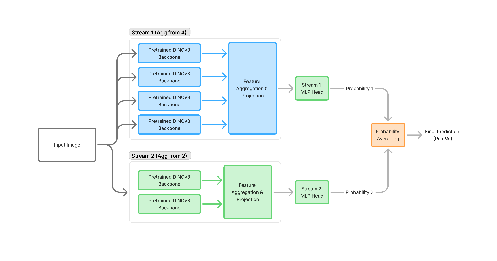

# AIGC Det

Pytorch 2.12 guesstimation of the [MICV_framework.md](MICV_framework.md)

The authors have not yet not released code or model weights. The initial defaults follow the paper where possible: two DINOv3 streams, four backbones in stream 1, two backbones in stream 2, per-stream projection and MLP heads, late probability averaging, focal loss, AdamW, warmup plus cosine scheduling, SWA, and ROC AUC validation.



## Current Scope

- Full end-to-end fine-tuning from the first training run.
- Local 1-2 GPU smoke runs with small DINOv3 variants.
- Cluster profile for the real training run.
- Manifest-first data loading for large datasets, with folder-to-manifest import support.
- Dummy-backbone smoke path for testing the trainer without Hugging Face access.

## Data Manifest

The canonical large-data interface is a CSV or Parquet manifest. Required columns:

```text
path,label,split
```

Recommended columns for the larger corpus:

```text
source_tier,source_dataset,generator,task_type,width,height,sha256,group_id
```

Labels may be numeric (`0`, `1`) or text (`real`, `fake`, `ai`, `generated`). Relative paths are resolved against `data.root_dir` when set, otherwise against the manifest directory.

Folder layouts can be converted with:

```powershell
python scripts/build_manifest.py --root D:\datasets\micv --output manifests/train.csv
```

The builder auto-detects these common layouts:

```text
root/train/real        root/real/train       root/real
root/train/fake        root/fake/train       root/fake
root/val/real          root/real/val
root/val/fake          root/fake/val
```

You can also point at explicit directories:

```powershell
python scripts/build_manifest.py `
	--root D:\datasets\micv `
	--real-dirs D:\data\photos_real `
	--fake-dirs D:\data\generated_a D:\data\generated_b `
	--binary-split train `
	--output manifests/train.csv
```

Use `--layout split-class`, `--layout class-split`, or `--layout binary-dirs` when auto-detection is not specific enough. Use `--real-names` and `--fake-names` if your folders are named differently.

For mixed sources where some folders must stay in a specific split and other folders should be randomly split, use a hybrid YAML spec:

```yaml
root: D:/datasets/micv
seed: 42
random_train_fraction: 0.8
random_split_unit: leaf-folder
sources:
  - path: heldout_real
    label: real
    split: val
    source_dataset: heldout_real
  - path: heldout_fake
    label: fake
    split: val
    generator: heldout_generator
    source_dataset: heldout_fake
  - path: training_real
    label: real
    split: train
    keep_percent: 100
    min_per_leaf_folder: 1
  - path: pooled_real
    label: real
    split: random
    keep_percent: 25
    min_per_leaf_folder: 1
  - path: pooled_fake
    label: fake
    split: random
    generator: mixed_local_aigc
    keep_percent: 50
    min_per_leaf_folder: 1
```

Build the combined manifest with:

```powershell
python scripts/build_manifest.py --spec manifests/hybrid.yaml --output manifests/hybrid.csv
```

The emitted `split` column remains the source of truth. Forced train and validation sources are written directly to those splits; random sources are shuffled with the configured seed and assigned to `train` or `val`. Use `random_split_unit: leaf-folder` when folders contain related images that should not cross the train/validation boundary.

## Local Smoke Training

The local configs are set to `facebook/dinov3-vitb16-pretrain-lvd1689m`. Set `data.train_manifest` and `data.val_manifest` before running against real data.

```powershell
python scripts/train.py --config configs/local_smoke.yaml
```

For a trainer-only check without Hugging Face access, keep `model.use_dummy_backbone: true` in the smoke config.

## 2 GPU Trial

```powershell
torchrun --nproc_per_node=2 scripts/train.py --config configs/local_2gpu.yaml
```

## Cluster Run

Use `configs/cluster_32a100.yaml` as the base profile. The launcher command depends on the environment, but the script is designed for `torchrun` or a SLURM wrapper that sets `RANK`, `WORLD_SIZE`, and `LOCAL_RANK`.

## MICV Defaults Chosen Where Underspecified

- Feature aggregation: concatenate backbone pooled features inside each stream.
- Stream fusion: average sigmoid probabilities, matching the diagram.
- Training loss: fused focal loss by default, with optional stream auxiliary losses.
- Projection latent dimension: 512 locally, 1024 in the cluster profile.
- SWA: final 2-3 epochs by default.
- Validation: clean resize-only metric for model selection, optional static degraded validation for robustness reporting.
